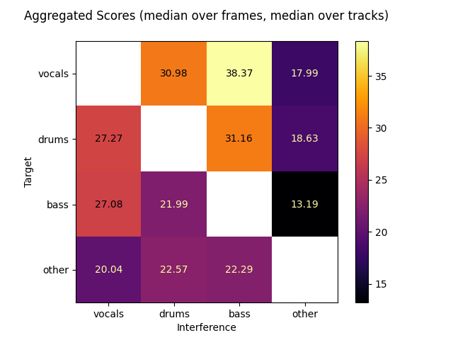

# museval-ssir

[](https://github.com/sigsep/sigsep-mus-eval/actions?query=workflow%3ACI+branch%3Amaster+event%3Apush)
[](https://pypi.python.org/pypi/museval)
[](https://pypi.python.org/pypi/museval)

A python package to evaluate source separation results using the [MUSDB18](https://sigsep.github.io/musdb) dataset.
This package is a modified version of [sigsep-mus-eval](https://github.com/sigsep/sigsep-mus-eval), which itself is an implementation of BSSEval v4.
More information about the original version can be found in their respective github or in the README_legacy.md.

### Modifications

This package adds the ability to evaluate the Source-to-Single-Interference Ratios (SSIR) of the source separation results.
The Source-to-Interference Ratio (SIR) gives information about the interference as a whole, not how much each source contributes to the interference.
SSIR gives information about how much each source contribute to the interference.

## Installation

You can install the `museval-ssir` parsing package using pip:

```bash
pip install museval-ssir
```

## Usage

The purpose of this package is to evaluate source separation results and generate bleeding matrices as well as write out validated `json` files.
`museval-ssir` is designed to work in conjuction with the [musdb](https://github.com/sigsep/sigsep-mus-db) tools and the MUSDB18 dataset (however, `museval-ssir` can also be used without `musdb`).

### Separate MUSDB18 tracks and Evaluate on-the-fly

- If you want to perform evaluation while processing your source separation results, you can make use `musdb` track objects.
Here is an example for such a function separating the mixture into a __vocals__ and __accompaniment__ track:

```python
import musdb
import museval-ssir

def estimate_and_evaluate(track):
    # Assume mix as estimates
    estimates = {
        'vocals': track.audio,
        'accompaniment': track.audio
    }

    # Evaluate using museval-ssir
    scores = museval-ssir.eval_mus_track(
        track, estimates, output_dir="path/to/json"
    )

    # Show nicely formatted and aggregated scores as a bleeding matrix
    scores.bleeding_matrix()
    
    # Write the bleeding matrix to a file
    # plt.savefig(output_directory_and_filename...)
    # plt.close()

mus = musdb.DB()
for track in mus:
    estimate_and_evaluate(track)

```
Make sure `output_dir` is set. `museval-ssir` will recreate the `musdb` file structure in that folder and write the evaluation results to this folder.

### Example results

The following bleeding matrix is a result from the results of using HT Demucs from [Demucs](https://github.com/adefossez/demucs) to perform source separation on the [MUSDB18](https://sigsep.github.io/musdb) dataset:



Note: When running the code as is, the results won't be the same as in the shown matrix.
This is due to ConfusionMatrixDisplay not recognizing NaN-values that are assigned to the diagonal.
The code has comments on how to modify ConfusionMatrixDisplay if one wishes to output identical results.
However, this is only a visual matter and doesn't affect the actual data shown.